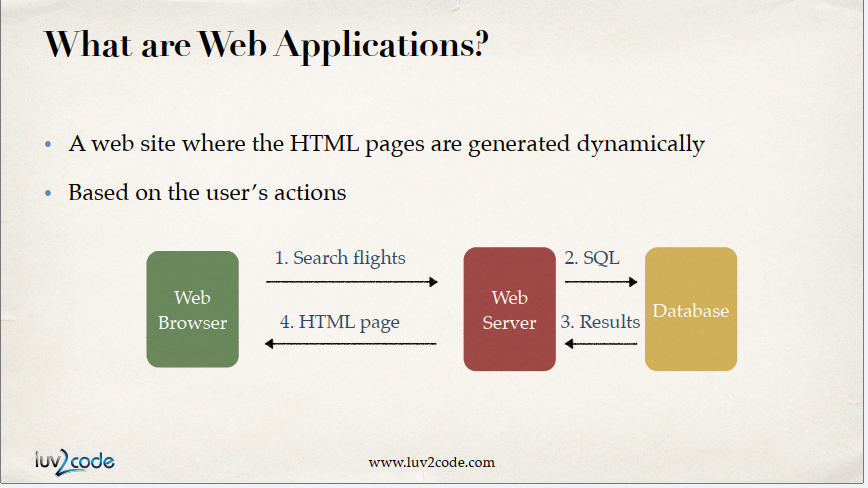

# JSP and sevrlet

Created: October 24, 2024 9:48 PM
Tags: back-end, front-end
Created by: Dinh Thang Nguyen

```csharp
//Your code here!
HOC CODE NAO!

```

- What are web application
    - Một trang web nơi các trang HTML được tạo ra một cách năng động
    - Dựa trên hành động của người dùng
    - 
    
    
    
    - 
- What are JSPs and Servlets?
    - Java code that runs on the web server
    - Reads user’s actions … normally from HTML Form
    - Thực hiện công việc
    - Returns an HTML page that is generated dynamically
    - 
    
    
    
- What is a JSP file?
    - Một trang HTML có chèn một số mã Java…
    - Bao gồm nội dung động từ mã Java
    
- Where is the JSP processed?
    - JSP is processed on the server
    - Kết quả của mã Java được đưa vào HTML trả về trình duyệt
- Where to place JSP file?
    - The JSP file goes in your WebContent folder
    - Must have .jsp extension
- JSP Expressions (bieu thuc)
    - Tính toán một biểu thức
    - Result is included in HTML returned to browser
    
    
    

- JSP Scriptlets (for , logic)
    - Insert 1 to many lines of Java code
    - Để đưa nội dung vào trang, hãy sử dụng: out.println(…)
    - Giảm thiểu số lượng mã scriptlet trong JSP
    - Tránh việc đổ hàng ngàn dòng mã vào JSP
    - Cấu trúc lại thành một lớp Java riêng biệt… sử dụng MVC
- Declaration (khai bao bien va ham)
    - Khai báo một phương thức trong trang JSP
    - Gọi phương thức trong cùng một trang JSP
- Call Java Class from JSP
    - Minimize the scriptlets and declarations in a JSP
    - Tránh việc đổ hàng ngàn dòng mã vào JSP
    - Cấu trúc lại thành một lớp Java riêng biệt… sử dụng MVC
    - <%@page import=*"ten_pakage.jsp.TenLop"*%>
    
    
    
- Call Java Class from JSP part 2
    - Given to you for free
    - Sử dụng chúng trực tiếp trong trang JSP của bạn
    - List of commonly used JSP objects
    - 
    
    ### 1. Đối tượng `request`
    
    Đối tượng `request` đại diện cho yêu cầu từ client đến server. Nó là một thể hiện của lớp `HttpServletRequest` và cung cấp các phương thức để lấy dữ liệu từ client.
    
    ### Các phương thức phổ biến:
    
    - **`getParameter(String name)`**: Lấy giá trị của tham số từ form (theo tên của tham số). Ví dụ: `request.getParameter("username")`.
    - **`getParameterNames()`**: Lấy danh sách các tên tham số từ form (trả về `Enumeration`).
    - **`getAttribute(String name)`**: Lấy giá trị của thuộc tính được đặt trong đối tượng request.
    - **`setAttribute(String name, Object obj)`**: Đặt một thuộc tính vào request, có thể truy cập trong JSP hoặc chuyển đến servlet.
    - **`getSession()`**: Lấy đối tượng `HttpSession` hiện tại, cho phép lưu trữ thông tin giữa các lần truy cập của cùng một người dùng.
    
    ### 2. Đối tượng `response`
    
    Đối tượng `response` đại diện cho phản hồi từ server đến client. Nó là một thể hiện của lớp `HttpServletResponse` và cung cấp các phương thức để điều khiển phản hồi gửi về client.
    
    ### Các phương thức phổ biến:
    
    - **`sendRedirect(String location)`**: Chuyển hướng người dùng đến một URL khác. Ví dụ: `response.sendRedirect("home.jsp")`.
    - **`setContentType(String type)`**: Đặt loại nội dung của phản hồi (ví dụ: `response.setContentType("text/html")`).
    - **`getWriter()`**: Lấy đối tượng `PrintWriter` để ghi dữ liệu ra client, thường dùng để hiển thị HTML.
    - **`addCookie(Cookie cookie)`**: Thêm cookie vào phản hồi để lưu trữ thông tin phía client.
    - **`setHeader(String name, String value)`**: Đặt một header trong phản hồi, ví dụ để xác định thông tin meta hoặc điều khiển bộ nhớ cache.
    
    Các phương thức này giúp lập trình viên dễ dàng truy xuất và xử lý dữ liệu khi làm việc với JSP, giúp tạo các trang web động và tương tác với người dùng hiệu quả.
    
    | Object | Description (mo ta) |
    | --- | --- |
    | request | Chứa tiêu đề yêu cầu HTTP và dữ liệu biểu mẫu |
    | response | Cung cấp hỗ trợ HTTP để gửi phản hồi |
    | out | JspWriter để bao gồm nội dung trong trang HTML |
    | session | Phiên duy nhất cho mỗi người dùng ứng dụng web |
    | application | Shared data for all users of the web application |
    |  | 
     |
- Including Files
    
    
    
    
    
    

- JSP sesstion (phien)
    
    
    - Phiên JSP được tạo một lần cho phiên trình duyệt của người dùng. Duy nhất cho người dùng này
    - Phiên làm việc này đại diện cho khoảng thời gian từ khi người dùng bắt đầu truy cập ứng dụng web cho đến khi kết thúc hoặc hết thời gian chờ. Trong suốt "phiên" đó, các thông tin của người dùng có thể được lưu lại, giúp duy trì trạng thái của người dùng trên các trang khác nhau trong ứng dụng.
    - Thường được sử dụng khi bạn cần theo dõi hành động của người dùng
    - useful methods :
    
    | method | description |
    | --- | --- |
    | isNew(): bool | return true if sesstion new  |
    | getId() | return sesstion id  |
    | invalidate() : void | làm mất hiệu lực phiên này và hủy liên kết bất kỳ
    đối tượng nào được liên kết với nó |
    | setMaxInactiveInterval(long mills) : void | Đặt thời gian nhàn rỗi cho một phiên hết hạn.
    Giá trị được cung cấp tính bằng mili giây |
    - Thêm dữ liệu vào đối tượng phiên :
    - 
    
    ```java
    
    session.setAttribute(String name, Object value) 
    
    List<String> items = new ArrayList<>();
    
    session.setAttribute(“myToDoList”, items);
    ```
    
    - Retrieve data from session object (lay du lieu)
    - 
    
    ```java
    Object session.getAttribute(String name)
    List<String> myStuff = (List<String>) session.getAttribute(“myToDoList”);
    
    ```
    

- JSP tag
    
    What are JSP tags?
    
    Mỗi trang sử dụng thẻ Core phải bao gồm tham chiếu này:
    
    ```java
    <%@ taglib uri="http://java.sun.com/jsp/jstl/core" prefix="c" %>
    ```
    
    | tag | description |
    | --- | --- |
    | catch | bắt bất kỳ cú ném nào xảy ra ở cậu bé (ngoai le) |
    | choose | thẻ có điều kiện có thể được sử dụng cho độc quyền
    hoạt động, tương tự như câu lệnh switch |
    | if  | điều kiện if/then đơn giản |
    | import | truy xuất một URL và hiển thị nội dung của nó trên trang
    hoặc một biến |
    | forEach | Iterates over a collection of values (Lặp lại một tập hợp các giá trị) |
    | forTokens | Lặp lại một bộ sưu tập mã thông báo |
    | out | Được sử dụng trong tập lệnh để hiển thị đầu ra,
    tương tự như <%= … %> |
    | otherwise 
     | Được sử dụng với thẻ <choose> để xử lý mệnh đề else |
    | param  | Thêm tham số vào URL |
    | redirect  | Chuyển hướng trình duyệt tới một URL mới |
    | remove |  Loại bỏ một biến có phạm vi |
    | set  | Gán một giá trị biểu thức cho một biến |
    | url | Xác định một URL với các tham số truy vấn |
    | when | được sử dụng với thẻ <choose>, khi điều kiện đúng |
- Internationalization
    
    What is Internationalization ?
    
    - Quốc tế hóa là quá trình thiết kế một ứng dụng
    - Vì vậy, nó có thể được điều chỉnh cho nhiều ngôn ngữ/khu vực khác nhau
    - Không có thay đổi nào đối với mã nguồn
    
    What is I18N? 
    
    - Thuật ngữ Quốc tế hóa thường được viết tắt là I18N
    - Có 18 chữ cái giữa chữ “i” đầu tiên và chữ “n” cuối cùng …. thật kỳ lạ :-)
    
    Formatting Messages 
    
    - Thay vì mã hóa cứng văn bản hiển thị/tin nhắn trong ứng dụng của bạn
    - Make use of labels / the placeholders
    - Bạn cần tạo các phiên bản dịch của từng nhãn (không có phép thuật nào ở đây)
    - Dựa trên lựa chọn ngôn ngữ của người dùng, hệ thống sẽ bao gồm văn bản phù hợp

- Cookies
    
    Mục đích
    
    - Cá nhân hóa trang web cho người dùng
    - Keep track of user preferences (theo doi so thich cua nguoi dung)
    
    Cookies what is a ??
    
    - Dữ liệu văn bản được trao đổi giữa trình duyệt web và máy chủ
    - Gom 2 thanh phan la Name va Value pair
    
    Cookie được truyền đi như thế nào?
    
    - Trình duyệt sẽ chỉ gửi cookie phù hợp với tên miền của máy chủ
    
    Khac
    
    - Package imported for free in all JSP pages
    - Constructor : Constructs a cookie with the specified name and value 
    Cookies(String name , String value)
    
    More:
    
    Trong JSP, **cookies** là các tệp dữ liệu nhỏ được lưu trữ trên trình duyệt của người dùng. Chúng được sử dụng để lưu trữ thông tin trong một khoảng thời gian dài hơn so với session, vì cookies không bị mất khi người dùng đóng trình duyệt (trừ khi cookie đó được cấu hình để hết hạn khi đóng trình duyệt).
    
    Cookies trong JSP có một số vai trò quan trọng, bao gồm:
    
    1. **Lưu trữ dữ liệu người dùng**: Cookies giúp lưu trữ thông tin người dùng như tên đăng nhập, sở thích cá nhân, hoặc các lựa chọn trước đó để tạo trải nghiệm cá nhân hóa cho người dùng khi họ quay lại trang web.
    2. **Duy trì trạng thái**: Cookies có thể được sử dụng để duy trì trạng thái khi người dùng đóng trình duyệt và quay lại trang web sau một thời gian. Điều này khác với session, vì session chỉ tồn tại trong suốt thời gian phiên làm việc và bị hủy khi người dùng đóng trình duyệt.
    3. **Theo dõi và phân tích**: Cookies thường được dùng cho mục đích theo dõi hành vi của người dùng trên trang web, giúp quản trị viên phân tích và tối ưu hóa trải nghiệm người dùng.
    
    ### Cách sử dụng Cookies trong JSP
    
    ### Tạo và thêm cookie vào phản hồi HTTP
    
    Để tạo một cookie mới trong JSP, bạn có thể sử dụng lớp `Cookie` và thêm cookie vào phản hồi HTTP để gửi tới trình duyệt của người dùng:
    
    ```java
    
    Cookie cookie = new Cookie("username", "Alice");  // Tạo cookie với tên 'username' và giá trị 'Alice'
    cookie.setMaxAge(60 * 60 * 24);  // Đặt thời gian sống của cookie là 1 ngày (đơn vị: giây)
    response.addCookie(cookie);  // Thêm cookie vào phản hồi
    
    ```
    
    ### Lấy cookie từ yêu cầu HTTP
    
    Để lấy cookie đã lưu trên trình duyệt khi người dùng quay lại trang web, bạn có thể dùng `request.getCookies()` để lấy danh sách các cookie hiện có, sau đó duyệt qua danh sách để tìm cookie theo tên:
    
    ```java
    
    Cookie[] cookies = request.getCookies();
    if (cookies != null) {
        for (Cookie c : cookies) {
            if ("username".equals(c.getName())) {
                String username = c.getValue();  // Lấy giá trị của cookie 'username'
                // Xử lý giá trị cookie...
            }
        }
    }
    
    ```
    
    ### Các thuộc tính quan trọng của Cookies
    
    - **`name` và `value`**: Mỗi cookie có tên (`name`) và giá trị (`value`) để xác định và lưu trữ thông tin.
    - **`maxAge`**: Định nghĩa thời gian sống của cookie (tính bằng giây). Khi `maxAge` hết hạn, cookie sẽ bị trình duyệt xóa. Đặt giá trị là `1` sẽ xóa cookie khi trình duyệt đóng.
    - **`path`**: Định nghĩa phạm vi đường dẫn của cookie trên trang web (mặc định là thư mục hiện tại).
    - **`secure` và `httpOnly`**: Bảo mật cookie; `secure` chỉ gửi cookie qua HTTPS, và `httpOnly` ngăn trình duyệt truy cập cookie thông qua JavaScript.
    
    Cookies là cách đơn giản để lưu trữ dữ liệu người dùng và duy trì thông tin trên trang web mà không phụ thuộc vào session.
    

- What Are Servlets
    - Java class that is processed on the server
    - Java class generates HTML that is returned to browser
    - Can read HTML form data, use cookies and sessions etc…
    - At a high-level, similar functionality to JSPs
    - more on that later
    
    Comparing JSP and Servlets 
    
    Which One 
    
    - Có thể sử dụng một trong hai để xây dựng các ứng dụng web Java…
    - Xây dựng toàn bộ trang web chỉ bằng Servlets… hoặc
    - Xây dựng toàn bộ trang web chỉ bằng cách sử dụng JSP
    
    Difference between GET and POST
    
    - Form POST method calls Servlet doPost() method
    - Sending Data with GET method
    - 
    - Khác :
    
    Trong Java Servlet, phương thức `GET` và `POST` được sử dụng để giao tiếp giữa client (trình duyệt) và server. Sự khác biệt giữa hai phương thức này chủ yếu dựa trên cách chúng truyền dữ liệu và mục đích sử dụng. Dưới đây là các điểm khác nhau:
    
    ### **1. Cách truyền dữ liệu**
    
    - **GET**:
        - Dữ liệu được truyền qua URL dưới dạng chuỗi query string (ví dụ: `?key1=value1&key2=value2`).
        - Dữ liệu được giới hạn về độ dài (thường khoảng 2000 ký tự, tùy trình duyệt).
        - Không an toàn khi truyền thông tin nhạy cảm vì dữ liệu hiển thị rõ trên URL.
    - **POST**:
        - Dữ liệu được gửi ẩn trong phần thân (body) của yêu cầu HTTP.
        - Không bị giới hạn độ dài dữ liệu.
        - Thích hợp để gửi thông tin nhạy cảm như mật khẩu hoặc dữ liệu lớn.
    
    ---
    
    ### **2. Mục đích sử dụng**
    
    - **GET**:
        - Được sử dụng để **lấy thông tin** từ server.
        - Phù hợp khi yêu cầu không thay đổi trạng thái của server (idempotent).
        - Dữ liệu có thể được cache bởi trình duyệt hoặc lưu lại trong lịch sử.
    - **POST**:
        - Được sử dụng để **gửi dữ liệu** đến server để xử lý (ví dụ: gửi form, tạo mới tài nguyên).
        - Không idempotent: mỗi yêu cầu POST thường tạo ra một thay đổi mới trên server.
        - Không được cache bởi trình duyệt.
    
    ---
    
    ### **3. Hiển thị URL**
    
    - **GET**:
        - Dữ liệu xuất hiện trong URL (ví dụ: `http://example.com/page?name=John&age=30`).
        - Phù hợp khi cần chia sẻ hoặc bookmark URL chứa dữ liệu.
    - **POST**:
        - Dữ liệu không hiển thị trong URL.
        - Phù hợp khi gửi dữ liệu không cần hiển thị ra ngoài.
    
    ---
    
    ### **4. Hiệu suất**
    
    - **GET**:
        - Nhanh hơn vì dữ liệu được gửi qua URL, không cần xử lý thêm phần thân.
        - Ít tiêu tốn tài nguyên server.
    - **POST**:
        - Chậm hơn vì có phần thân yêu cầu phải xử lý.
        - Tốn tài nguyên server hơn so với GET.
    
    ---
    
    ### **5. Trong Java Servlet**
    
    - **GET**:
        - Được xử lý trong phương thức `doGet(HttpServletRequest request, HttpServletResponse response)`.
        - Dùng để lấy dữ liệu hoặc hiển thị trang.
    - **POST**:
        - Được xử lý trong phương thức `doPost(HttpServletRequest request, HttpServletResponse response)`.
        - Dùng để gửi dữ liệu từ form hoặc thực hiện thay đổi trên server.
    
    ---
    
    ### **Ví dụ trong Servlet**
    
    ### Phương thức GET
    
    ```java
    java
    Sao chép mã
    protected void doGet(HttpServletRequest request, HttpServletResponse response) throws ServletException, IOException {
        String name = request.getParameter("name");
        response.getWriter().write("Hello, " + name);
    }
    
    ```
    
    URL: `http://example.com/hello?name=John`
    
    ### Phương thức POST
    
    ```java
    java
    Sao chép mã
    protected void doPost(HttpServletRequest request, HttpServletResponse response) throws ServletException, IOException {
        String name = request.getParameter("name");
        response.getWriter().write("Data received: " + name);
    }
    
    ```
    
    Form gửi dữ liệu:
    
    ```html
    html
    Sao chép mã
    <form action="/hello" method="POST">
        <input type="text" name="name" />
        <button type="submit">Submit</button>
    </form>
    
    ```
    
    ### **Khi nào nên dùng?**
    
    - **GET**: Khi yêu cầu không thay đổi trạng thái server (lấy dữ liệu, hiển thị trang).
    - **POST**: Khi gửi dữ liệu cần xử lý hoặc thay đổi trạng thái server (tạo mới, cập nhật dữ liệu).
    
- MVC
    
    **Model-View-Controller (MVC)** là một mẫu kiến trúc phần mềm được sử dụng rộng rãi trong phát triển ứng dụng, đặc biệt là các ứng dụng web. Mục tiêu chính của MVC là tách riêng các thành phần để dễ dàng quản lý, bảo trì và phát triển. Ba thành phần chính của MVC bao gồm:
    
    ### 1. **Model (M)**
    
    - **Chức năng:**
        - Quản lý dữ liệu và logic của ứng dụng.
        - Chịu trách nhiệm giao tiếp với cơ sở dữ liệu hoặc các tầng xử lý logic kinh doanh.
        - Đảm bảo dữ liệu được cập nhật và nhất quán.
    - **Ví dụ:**
        - Lớp Java tương tác với cơ sở dữ liệu (DAO).
        - Đối tượng biểu diễn thực thể (Entity).
    
    ---
    
    ### 2. **View (V)**
    
    - **Chức năng:**
        - Hiển thị dữ liệu cho người dùng.
        - Là giao diện người dùng (UI), chỉ chịu trách nhiệm trình bày mà không xử lý logic.
    - **Ví dụ:**
        - Các trang JSP, HTML, CSS, JavaScript.
        - Kết quả hiển thị thông qua các biểu mẫu hoặc trang web.
    
    ---
    
    ### 3. **Controller (C)**
    
    - **Chức năng:**
        - Nhận yêu cầu (request) từ người dùng.
        - Điều hướng yêu cầu đến Model để xử lý và chọn View phù hợp để trả về.
        - Điều phối logic ứng dụng và chịu trách nhiệm xử lý luồng công việc.
    - **Ví dụ:**
        - Servlet trong ứng dụng Java Web.
        - Controller xử lý yêu cầu HTTP và trả về phản hồi.
    
    ---
    
    ### **Cách hoạt động của MVC:**
    
    1. Người dùng tương tác với **View** (gửi yêu cầu thông qua giao diện).
    2. **Controller** nhận yêu cầu từ View, xử lý hoặc gọi **Model** để thực hiện logic.
    3. **Model** trả về dữ liệu cho Controller sau khi xử lý.
    4. **Controller** chọn View để hiển thị dữ liệu được trả về từ Model cho người dùng.
    
    ---
    
    ### **Lợi ích của MVC:**
    
    - **Tách biệt trách nhiệm:** Giúp mỗi thành phần tập trung vào vai trò riêng của mình.
    - **Dễ bảo trì:** Việc thay đổi giao diện hoặc logic sẽ không ảnh hưởng lớn đến các thành phần khác.
    - **Tái sử dụng:** Có thể tái sử dụng View hoặc Model cho các mục đích khác nhau.
    - **Phát triển đồng bộ:** Nhiều nhóm có thể làm việc trên các phần khác nhau (Model, View, Controller) mà không gây xung đột.
    
    Bạn có thể áp dụng MVC trong JSP/Servlet bằng cách:
    
    - Sử dụng JSP làm View.
    - Sử dụng Servlet làm Controller.
    - Sử dụng các lớp Java khác làm Model.

- TongHop
    
    Trong JSP, có ba thành phần chính để nhúng mã Java vào trang JSP: **Scriptlet**, **Expression**, và **Declaration**. Dưới đây là sự phân biệt giữa ba thành phần này:
    
    1. **Scriptlet** (`<% ... %>`)
        - **Cú pháp**: `<% code %>`
        - **Mục đích**: Được sử dụng để chèn các đoạn mã Java. Các đoạn mã này có thể chứa logic điều kiện, vòng lặp, hoặc bất kỳ đoạn mã nào mà bạn muốn chạy trong khi trang đang được tạo.
        - **Ví dụ**:
            
            ```
            jsp
            Sao chép mã
            <%
                int a = 10;
                out.println("Giá trị của a là: " + a);
            %>
            
            ```
            
        - **Thời điểm thực thi**: Mã Java trong Scriptlet được chuyển thành mã của phương thức `service()` trong Servlet, và được thực thi mỗi khi trang JSP được yêu cầu.
    2. **Expression** (`<%= ... %>`)
        - **Cú pháp**: `<%= expression %>`
        - **Mục đích**: Được sử dụng để in giá trị của một biểu thức Java trực tiếp ra trang. Biểu thức trong `<%= ... %>` sẽ được đánh giá và chuyển đổi thành chuỗi (nếu không phải chuỗi).
        - **Ví dụ**:
            
            ```
            jsp
            Sao chép mã
            <%= "Xin chào JSP!" %>
            
            ```
            
        - **Thời điểm thực thi**: Giống như Scriptlet, nhưng nội dung của Expression tự động được chuyển đổi thành chuỗi và hiển thị trên trang web mà không cần `out.println`.
    3. **Declaration** (`<%! ... %>`)
        - **Cú pháp**: `<%! declaration %>`
        - **Mục đích**: Được sử dụng để khai báo các biến và phương thức mà bạn muốn sử dụng trong nhiều phần của trang JSP. Biến và phương thức trong Declaration sẽ trở thành các thành viên của lớp Servlet.
        - **Ví dụ**:
            
            ```
            jsp
            Sao chép mã
            <%!
                int x = 100;
                public int sum(int a, int b) {
                    return a + b;
                }
            %>
            
            ```
            
        - **Thời điểm thực thi**: Chỉ được thực thi một lần khi trang JSP được tải vào bộ nhớ. Các biến và phương thức trong Declaration sẽ là thành viên của lớp và tồn tại trong suốt quá trình thực thi.
    
    **Tóm lại**:
    
    - **Scriptlet**: Để thực thi mã Java, logic điều kiện, vòng lặp trong quá trình tạo trang.
    - **Expression**: Để in giá trị trực tiếp ra trang.
    - **Declaration**: Để khai báo biến và phương thức dùng cho toàn bộ trang.
    
    Khi làm việc với JSP, bạn nên hạn chế sử dụng Scriptlet và Declaration mà thay vào đó sử dụng các thư viện JSTL và EL (Expression Language) cho mã dễ bảo trì hơn.
    
-
